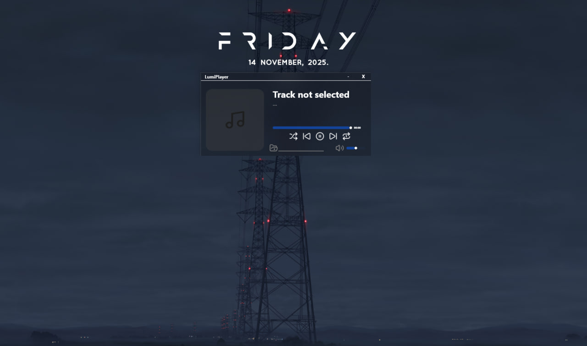
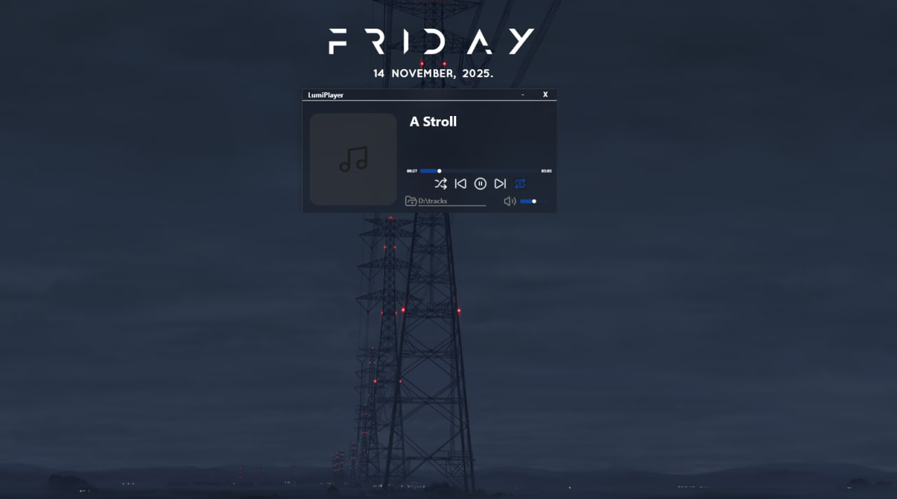

# Lumi Player

Lumi-Player is a minimalist music player with a transparent and modern design. It's made for those who appreciate simplicity and convenience, allowing easy listening to tracks from local folders without unnecessary features or cluttered interface.


## Screenshots

### 1) Standard player view  
Without a selected folder and no track playing  


### 2) Example song 1  


### 3) Example song 2  


## Features

- The app does not differentiate between light and dark modes; its transparent design allows it to seamlessly blend with any theme.
- Beautiful and clean design for each track display.
- Compact window size for convenient and unobtrusive use.
- Optimized for low CPU and memory usage, ensuring smooth performance without lag
- Supports easy local folder playback without the need for complicated setup.
- Minimalistic interface focused on ease of use without unnecessary features.

## Deployment

To deploy this project run

1. Clone this repository:
```bash
git clone https://github.com/Rywent/Lumi-Player.git
```
2.  Open the project in Visual Studio:
```bash
cd Lumi-Player
```

On the release branch, stable versions of the project are built and maintained for deployment and use.

